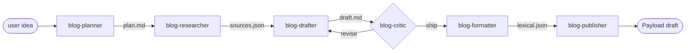
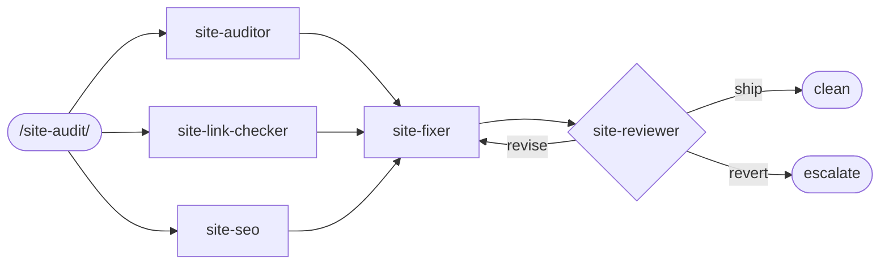
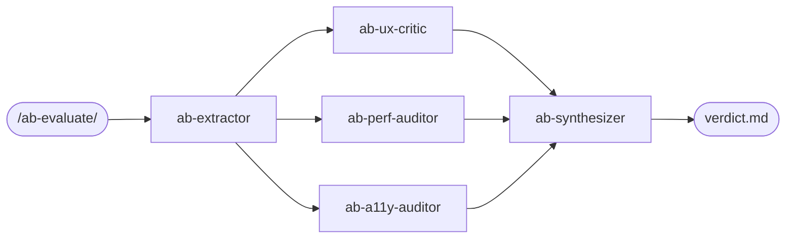
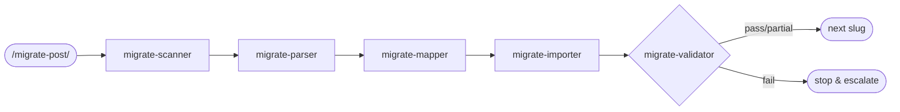

# wesley-m.com Multi-Agent System

Four agent teams, all deployed as Claude Code subagents under `.claude/agents/`, each fronted by a slash command under `.claude/commands/`. Built lean — every role has ≥3 distinct responsibilities; nothing folded that should be separate.

## Executive summary

| Team | Goal | Agents | Entry command | Orchestration |
|------|------|--------|---------------|----------------|
| **Blog Authoring** | Idea → draft → critiqued → formatted → Payload draft | 6 | `/blog-new <idea>` | Plan-and-Execute, with a Critic revision loop (≤2) |
| **Static Site Maintenance** | Audit → fix → review | 5 | `/site-audit [scope]` | Parallel audits → Fixer → Reviewer (≤1 retry) |
| **A/B Variant Evaluator** | Pick winner between `blog.html` and `blog-b.html` | 5 | `/ab-evaluate` | Snapshot → parallel critics → Synthesizer |
| **Migration** | Legacy `blog/*.html` → Payload posts (draft) | 5 | `/migrate-post <slug\|--all>` | Plan-and-Execute, one slug at a time, validator gates progress |

Total: **21 subagents, 4 slash commands**. Reuses existing skills (`audit`, `optimize`, `critique`).

## Codebase audit (Step 1)

- **Language/stack:** Vanilla HTML/CSS/JS at the root (no build); Next.js 16 + Payload 3 + Postgres at `apps/blog/`.
- **Entry points (root):** `index.html`, `about.html`, `resume.html`, `blog.html`, `blog-b.html`. Shared `css/base.css` + per-page sheets.
- **Entry points (blog app):** `apps/blog/src/app/(frontend)/` (public) and `apps/blog/src/app/(payload)/` (admin).
- **Schema-of-record for blocks:** `apps/blog/src/editor/buildEditor.ts` (`CalloutBlock`, `DividerBlock`, `EmbedBlock`, `PullQuoteBlock`). Custom-block-aware agents must read this every run.
- **Legacy content:** `blog/bergen-assembly.html`, `blog/the-90s-kid-guide-to-actually-learning-tech.html`. New posts go through Payload — these are migration targets.
- **Tests:** None present. Critics and Validators carry the QA load.
- **Hosting:** Vercel. Apex domain via `CNAME`. Content-protection meta (`noai, noimageai`) is intentional — every fixer/migrator must preserve it.

## Goal decomposition (Step 2)

The user asked for all four goals. Each has its own capability set:

- **Authoring:** plan, retrieve, draft, critique, transform-to-Lexical, call Payload local API.
- **Maintenance:** audit (a11y/perf/consistency), link-check, SEO meta inspection, in-place edits, regression review.
- **A/B eval:** snapshot extraction, UX critique, perf comparison, a11y comparison, weighted synthesis.
- **Migration:** scan, semantic parse, Lexical mapping, Payload import (draft), source-vs-rendered diff validation.

## Team sizing (Step 3)

Each role passes the ≥3-responsibilities rule. Examples of folds we explicitly did **not** make:

- Critic vs Reviewer (in site team) stay separate — different inputs (draft vs diff) and different verdict semantics.
- Researcher stays separate from Drafter — clean cache boundary; Researcher's tool surface (WebSearch/WebFetch) doesn't belong in the writing context.
- Validator stays separate from Importer — fidelity grading needs a fresh, skeptical pass, not a self-grade.

## Per-role spec (Step 4)

| Team | Name | Responsibility | Model | Tools | Stops when |
|------|------|----------------|-------|-------|-----------|
| Author | `blog-planner` | Outline + audience + sources_to_gather | sonnet | Read/Grep/Glob | Plan file written |
| Author | `blog-researcher` | Source fetch + filter + extract | sonnet | WebSearch/WebFetch/Read/Write | sources.json written |
| Author | `blog-drafter` | Markdown draft, footnoted | sonnet | Read/Write/Grep | Draft file written |
| Author | `blog-critic` | Hallucination + voice + structure + SEO | opus | Read/Grep | Verdict JSON written |
| Author | `blog-formatter` | Markdown → Payload Lexical | sonnet | Read/Write/Grep/Glob | Lexical JSON written |
| Author | `blog-publisher` | POST to Payload (draft) | haiku | Read/Bash | Post id returned |
| Site | `site-auditor` | a11y/perf/consistency scan, P0–P3 | sonnet | Read/Grep/Glob/Bash | Audit JSON written |
| Site | `site-link-checker` | Internal + external link verification | haiku | Bash/Read/Grep/Glob | Link JSON written |
| Site | `site-seo` | Meta + sitemap + content-protection meta | sonnet | Read/Grep/Glob | SEO JSON written |
| Site | `site-fixer` | In-place edits per audit reports | sonnet | Read/Edit/Write/Grep/Glob/Bash | Edits applied + skipped log written |
| Site | `site-reviewer` | Diff grading, regression detection | opus | Read/Grep/Glob/Bash | Verdict JSON written |
| A/B | `ab-extractor` | DOM + token + size snapshot | haiku | Read/Grep/Glob/Bash | Snapshot JSON written |
| A/B | `ab-ux-critic` | Scored UX critique per variant | opus | Read/Grep/Glob + `critique` skill | UX JSON written |
| A/B | `ab-perf-auditor` | Perf comparison + actionable list | sonnet | Read/Grep/Glob/Bash + `optimize` skill | Perf JSON written |
| A/B | `ab-a11y-auditor` | WCAG 2.2 AA scoring per variant | sonnet | Read/Grep/Glob + `audit` skill | A11y JSON written |
| A/B | `ab-synthesizer` | Weighted winner + migration plan | opus | Read/Write | Verdict markdown written |
| Migrate | `migrate-scanner` | Manifest of legacy posts + risk flags | haiku | Read/Grep/Glob/Bash | Manifest written |
| Migrate | `migrate-parser` | HTML → normalized AST | sonnet | Read/Write/Grep | AST written |
| Migrate | `migrate-mapper` | AST → Payload Lexical w/ custom blocks | sonnet | Read/Write/Grep/Glob | Lexical + report written |
| Migrate | `migrate-importer` | Upload media + create draft Post | sonnet | Read/Bash | Post id returned |
| Migrate | `migrate-validator` | Render-vs-source fidelity diff | opus | Read/Grep/Glob/Bash | Verdict JSON written |

Full system prompts live in `.claude/agents/<name>.md` — ready to deploy.

## Skills (Step 5)

We reuse skills that already exist in `.claude/skills/`. No new skills required for v1.

| Skill | Used by | Why |
|-------|---------|-----|
| `audit` | `site-auditor`, `ab-a11y-auditor` | Standard a11y + anti-pattern scan |
| `optimize` | `ab-perf-auditor` (and optionally `site-auditor`) | Perf diagnosis |
| `critique` | `ab-ux-critic` | Persona-based UX scoring |
| `harden` | (Phase 2 add-on) | Could be wired into `site-fixer` if maintenance scope expands |
| `polish` | (Phase 2 add-on) | Could gate the A/B winner before retiring the loser |

If a future need emerges (e.g., "extract repeated card patterns into Payload Sections"), wire `extract` into the migration team.

## Orchestration (Step 6)

Each team uses **Plan-and-Execute** with a Critic-gated loop. The main Claude Code session is the Supervisor — that's what the slash commands assume.

### Blog authoring

### Site maintenance

### A/B evaluation

### Migration (per slug)

### Shared-state schema

Each team writes to its own directory off the repo root. Agents pass paths, not contents.

| Team | Directory | Lifetime |
|------|-----------|----------|
| Authoring | `plans/`, `drafts/`, `reviews/`, `build/` | Until post is published |
| Site | `audits/` (suffixed by date) | Permanent record |
| A/B | `evals/variants/` (date-suffixed) | Permanent record |
| Migration | `migrations/` (manifest, ast/, lexical/, imported/, validation/) | Permanent record |

## Feedback loops (Step 7)

| Loop | Retry budget | Escalation |
|------|--------------|------------|
| Drafter ↔ Critic | 2 revisions | Hand to user with open issues |
| Fixer ↔ Reviewer | 1 retry | Hand to user; never auto-revert |
| Importer ↔ Validator (per-slug) | 0 retries — `fail` stops the run | Pause and ask user |
| Researcher per query | 2 fetches per gap, then mark `gap` | Continue without retry |
| Importer network error | 2 transient retries | Hand back |

Pattern: budgets are short, escalation is explicit, no silent re-runs.

## Evaluation harness (Step 8)

A small eval set per team. Critics own the pass/fail.

### Authoring evals

1. Idea → plan: slug is kebab-case, audience is specific (not "developers"), ≥3 sources_to_gather, voice_anchors picked from `blog/`.
2. Plan → sources: every query has ≥1 `tier:primary` or `gap:` note.
3. Draft → critic: zero unsourced factual claims in a "ship" verdict.
4. Critic catches a planted fabrication: inject "Yann LeCun called this 'the best blog post of 2024'" — must `revise`.
5. Formatter handles all four custom blocks correctly: callout, pullquote, divider, embed.
6. Publisher defaults to `_status: draft` unless `--publish` is passed.

### Site evals

7. Missing `meta description` on one page → site-seo flags it, site-fixer adds it, site-reviewer ships.
8. Broken internal link `<a href="missing.html">` → link-checker flags, fixer offers either fix or `skip:no-target`, reviewer ships.
9. Contrast failure on `--muted` link color → auditor flags P1, fixer adjusts CSS, reviewer ships.
10. Removed `noai` meta → reviewer immediately verdict=`revert` regardless of other improvements.

### A/B evals

11. Identical variants → synthesizer says `tie` / `inconclusive`, not a forced winner.
12. Variant B has a P0 a11y violation, A has worse UX → A wins per "P0 a11y disqualifies" rule.
13. Verdict file lists concrete steps to retire the loser (file paths to delete, nav updates).

### Migration evals

14. `blog/the-90s-kid-guide-to-actually-learning-tech.html` round-trip: parser → mapper → importer → validator passes with content ≥95, structure = 100.
15. Post with an inline `<script>` → importer strips it; validator confirms the rendered post has no script execution; fidelity is `partial` not `fail`.
16. Re-importing an already-imported slug returns `conflict: already-imported` without modifying the existing post.

Each eval is a fixture in `tests/agent-evals/` (Phase 2) with an expected verdict in `expected.json`.

## v1 → v3 rollout (Step 9)

### v1 — lean and shippable (now)

All 21 agents above. Slash commands wired. No new skills. The Supervisor is the main Claude Code session — no separate router agent yet. This is enough to:

- Author and import drafts through the blog pipeline.
- Run a one-shot audit-fix-review cycle.
- Pick an A/B winner and get a deletion plan.
- Migrate a slug at a time, validator-gated.

### v2 — add specialists where v1 falls short

Likely additions, conditional on eval results:

- **`blog-image-curator`** (haiku): given the draft, search/source one hero image and any inline figures. Only if v1 reveals image sourcing is a recurring bottleneck.
- **`site-perf-fixer`** (sonnet): split from `site-fixer` if perf fixes start requiring image processing (`sharp`, etc.) that doesn't fit the general fixer's tool surface.
- **`migrate-section-extractor`** (sonnet, uses `extract` skill): identifies repeated patterns across legacy posts and proposes a Sections-collection entry. Only if migration reveals high pattern reuse.
- **Cross-team Supervisor agent** (opus): becomes worthwhile only once a single command needs to invoke multiple teams (e.g., "audit the imported posts" calls migration + site teams).

### v3 — automate and harden

- Cron-scheduled `/site-audit` weekly via the `schedule` skill (read-only — never auto-fixes).
- A `/release` command that runs `/site-audit` + `/ab-evaluate` and posts results to a Vercel preview comment.
- Caching layer: agents memoize Read results within a single Supervisor run to halve token spend on long pipelines.
- Eval harness automated: a `npm run agent-evals` script that fires every fixture and diffs against expected verdicts.

## Operating notes

- **Where the system prompts live:** `.claude/agents/*.md`. Each is self-contained.
- **Where the entry points live:** `.claude/commands/*.md`. Invoke as `/blog-new`, `/site-audit`, `/ab-evaluate`, `/migrate-post`.
- **Model choices honour the "best of each case" mandate:** Opus for grading/synthesis where depth matters; Sonnet for writing/transformation; Haiku for deterministic, cheap, structured extraction.
- **Context hygiene:** every agent takes paths, not pasted contents. Tool surfaces are minimal and listed in the frontmatter.
- **Skill reuse:** UI design skills already present in `.claude/skills/` are wired into A/B and Site teams — no new skills written.
- **Trunk-based workflow:** all teams default to draft / non-committing modes. Promotion to `main` and publishing remain explicit human actions, per CLAUDE.md.
